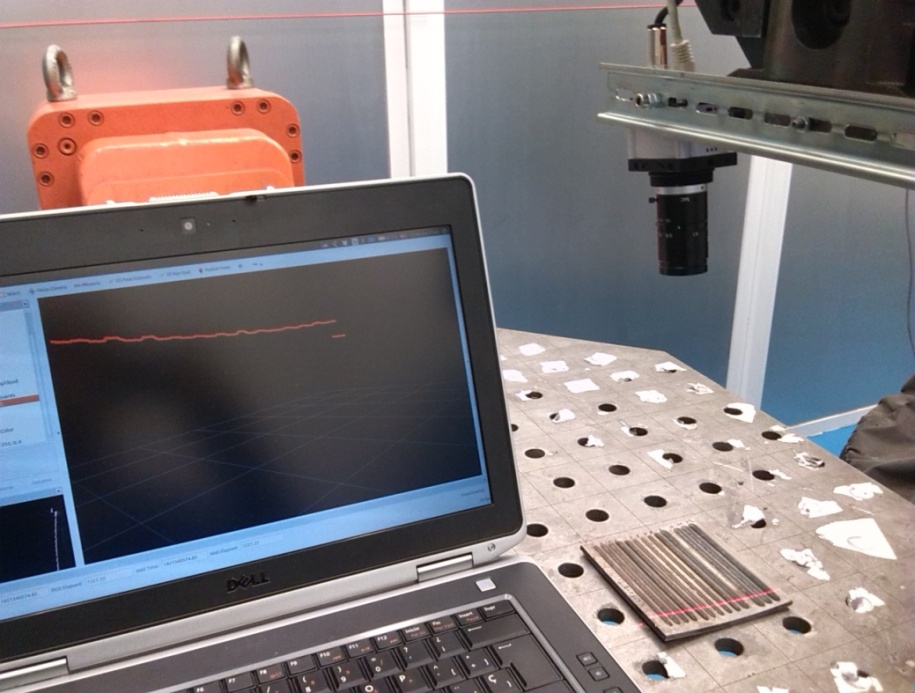
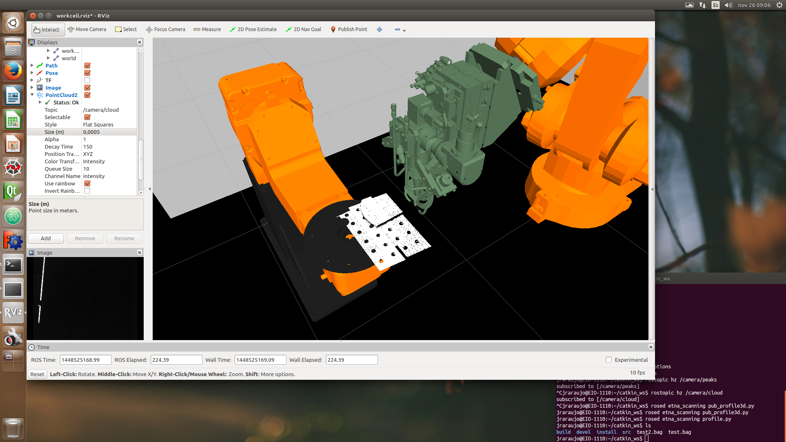

# Proper

Vision guided 3D Direct Laser Repair of Complex Metal Parts.

## Introduction

Laser Metal Deposition (LMD) is a promising additive-manufacturing technique
for repair or fabrication of near-net-shape (i.e. close to the designed final
shape) metal components. Parts are built up layer-by-layer directly from a 3D
CAD model, through the successive deposition of partially overlapped clad
tracks. A laser beam is used to melt the powder particles injected on the
surface of the component while is moved along the tracks path. This is based on
the traditional laser cladding process, which is widely used in industry for
coating and repair of critical parts like turbine blades and stamping molds.

The complexity of laser cladding makes a challenge to adequate the process
parameters (e.g. traverse speed, laser power, powder feed rate) to achieve an
homogeneous layer with an specific properties. In a traditional way, a set of
parameters is supposed to give constant conditions through the successive
deposition of tracks. Thus the laser path required to build up the part is
calculated off-line based on a constant layer height and track width. Therefore
the final volume can be achieved assuming no distortions during the process.

Tracks are affected by heating and part geometry during the process, especially
building large parts. The piece suffers from geometrical distortions and clad
defects. It is particularly affected by overheating and accumulation of
residual thermal stresses, main cause of building defects. As a consequence,
the final dimensions and properties of each manufactured part are not
guaranteed. The difficulty to get a constant operation through the successive
deposition of material becomes necessary to develop monitoring and control
tools.

In recent years, several closed-loop control systems have been proposed to
improve the laser cladding stability during the process [1]. These control
systems mainly use a coaxial arrangement for the melt pool monitoring  (i.e.
  temperature or width), acting on the laser power to overcome the effects of
thermal variations. However, LMD suffers from a lack of more specific
solutions beyond the melt pool monitoring and control.

Compatible with current coaxial solutions, a novel approach focused on the
on-line geometrical measurement and laser path adaptation of the LMD process
has been proposed [2]. This enables the detection and correction of geometrical  
distortions to avoid the final result affectation. Besides improving the
accuracy and finishing of the near-net-shape part built from the 3D design
model. It takes special attention to the flexibility required to be exploited
on current laser cladding industrial facilities.

This 3D scanning solution for geometrical monitoring has been demonstrated that
is suited to work on-line in a robotized LMD process, able to different  
configurations and conditions through a self-calibrated procedure. In this way,
the system is able to provide a point cloud in the working coordinates with no
constraints in the movement of the robot.

[1] J. Rodriguez-Araujo, J.J. Rodriguez-Andina, J. Farina, F. Vidal, J.L. Mato,
M.A. Montealegre, “Industrial Laser Cladding Systems: FPGA-Based Adaptive
Control”, IEEE Industrial Electronics Magazine, vol. 6, no. 4, pp. 35-46, Dec.
2012.

[2] J. Rodriguez-Araujo, J.J. Rodriguez-Andina, "ROS-based 3D on-line monitoring
of LMD robotized cells", 2015 IEEE 13th International Conference on Industrial
Informatics (INDIN), vol., no., pp. 308-313, 22-24 July 2015.

## Description

It is based on the [3D monitoring system](https://github.com/openlmd/etna),
which provides an on-line scanning solution able to provide accurate and
calibrated geometrical information in robot working coordinates. The laser
line is detected in the image and transformed to 3D coordinates in the camera
frame. Finally, the point cloud is resolved on-line in the working cell
coordinates with independence of the process speed and the robot path
trajectory.

The achieved accuracy is enough to distinguish tracks with a height lower than
0.5mm, as shown the next picture.



*3D profile in the robot working coordinates from a piece with multiple single tracks.*

Robot working coordinates monitoring is the key piece for the dimensional
control of the 3D manufacturing system. Moreover, this solution allows to
obtain directly the 3D scanning of the part in its position inside the working
cell in its real dimensions.

## Contents

This meta-package contains two packages:
- proper_workcell: contains the working cell description files.
- proper_robviz: contains the customized graphical user interface.
- proper_cloud: contains some useful tools used for 3D filtering (under
  development).

## Quick start



To record a bag file with the scanning information:

```shell
roslaunch proper_workcell workcell.launch
rosrun rosbag record -O scan.bag /camera/cloud /joint_statates
```

To play a bag file with the scanning information:

```shell
roscore
rosrun rosbag play scan.bag --clock
roslaunch proper_robviz robviz.launch sim:=true
```

To convert a bag file with the scanning information to a point cloud in *xyz*
format you can use the button *Record Cloud* in the interface, or to run the
commands to bellow:

```shell
roscore
roslaunch proper_workcell workcell.launch sim:=true
rosrun proper_cloud sub_cloud.py
rosrun rosbag play scan.bag --clock
```

## Acknowledgement

This work is been supported by the European Commission through the research
project "Laser equipment ASsessment for High impAct innovation in the
manufactuRing European industry (LASHARE)", FP7-2013-NMP-ICT-FOF - Grant
Agreement Nº 609046.

[http://www.lashare.eu/](http://www.lashare.eu/)
